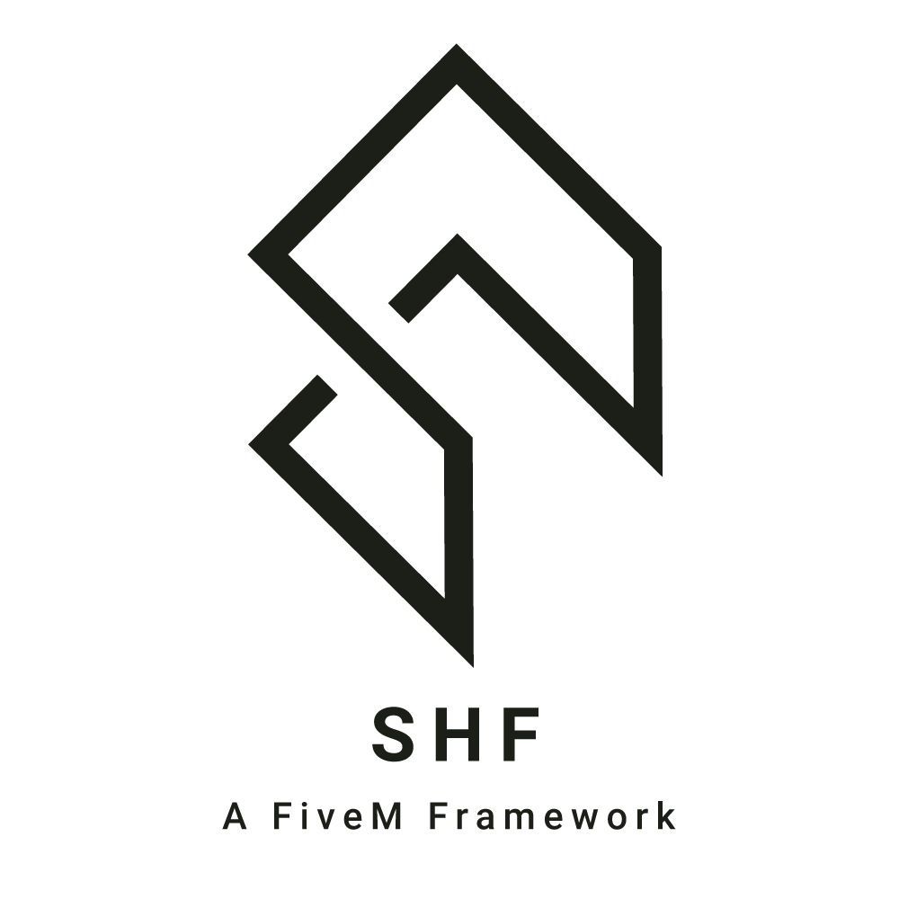

<h3 align="center">
    
      
    <b>A new concept of scripting for FiveM 🐌</b> 
</h3>

  
  
  
  

<h1 align="center">Welcome to SHF Framework!</h1>

<strong>Pay attention!</strong>  
This project is still <strong>being built</strong>! Soon we will have a website for more details!
 
 att: <a href="https://github.com/fl4m3x">Nattefrost</a> (me) and <a href="https://github.com/LucasGutierreCraveiro">Aron</a>
